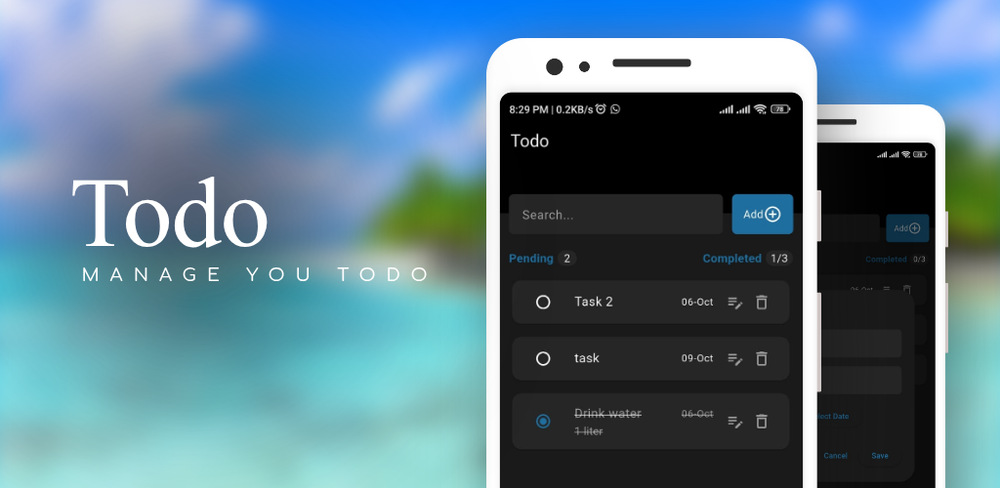

# Todo App

A simple **Todo App** built with **Flutter** following **Clean Architecture** principles, using **Bloc** for state management. The UI is inspired by **Dart's modern design** with clean and minimal styling. The app stores todos using **Firebase Firestore** and allows easy management of tasks.

---

## Features

- Add, edit, and delete todos
- Real-time updates using Firestore
- State management using Bloc
- Clean and minimal Dart-style UI
- Organized using Clean Architecture

---

## Tech Stack

- Flutter
- Firebase (Cloud Firestore)
- Bloc (flutter_bloc)
- Provider
- Dartz
- GetIt
- Intl

---

## Getting Started

### Prerequisites

- Flutter SDK installed ([Flutter installation guide](https://flutter.dev/docs/get-started/install))
- Firebase account
- Android Studio / VS Code or any IDE
- Emulator or physical device

---

### Installation

1. **Clone the repository**
   ```bash
   git clone <https://github.com/Azeemmtk/todo.git>
   cd <repo-folder>
